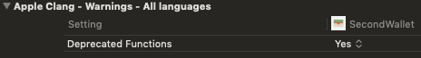

When was your last time getting a palm face while diving into an existing project? Have you ever wonder who on earth can ever add any features to it? You are not alone; we all have been to this moment, sooner or later.

I have been working on many projects, and most of them are antique due to lack of maintenance. I agree that developers should not change uncomprehended codes, as it's like entering the mine zone with barefoot. Equally, it is also important to keep the wheel rolling into the right direction. In my opinion, redundant unclarity is always evitable. Today, I want to share our approaches that help the team drive the projects into the desired path.

---

## Zero Xcode warning

I have heard developers said, "The application works fine with warnings, why bother?" I want to reference the [broken windows theory](https://en.wikipedia.org/wiki/Broken_windows_theory) into this rule. In the codebase, a warning is like a broken window. When the developer ignores those warnings, he builds up his tolerance to the severe error. Then no one cares about the quality when it is too late to address, which sets fire on the project.

This rule is quite difficult because there are some tricky circumstances.

For instance, if the project is using third-party libraries, it probably brings in the warning as well. It is out of our hands to fix the warning. On the other hand, it is also our responsibility to decide whether to integrate the third-party library or not.

Another is the warning about the deprecated functions. It is unavoidable if the product still supports old iOS versions, and there are some ways to strip out the noise. However, I do recommend you maintain a list of deprecated functions which is helpful when you are going to drop the support for an outdated iOS version.



In my team, we use SwiftLint to enforce the style and conventions, and we treat warnings as errors on the continuous integration server.  Consequently, this setup saves us effort from the discussion of trivial things in code-review.

## Shared branch is always compilable

In the modern development process, we are encouraged to have regular and short release cycles. So that we can get early feedback to adjust our course. The routine release is not possible without a stable codebase.

It is often frustrating when the compiler shoots you the errors after a fresh clone of the repo. It even makes people furious when someone responded: "It works fine on my machine." If a developer cannot ensure the branch is compilable, how can we trust him that his code does not crash the application?

To maintain the integrity of the main branch, we set up a daily build in the midnight, and it clones the project with a clean slate. You might wonder why not just apply it to all builds; It's because we don't want to waste time on cloning the gigantic project on every commits.

[*] To enable this rule, it requires the whole team aligned with the same Xcode version. 

## A Concise checklist for making a pull-request

I have seen many teams keep back and forth on a pull-request for slight negligence. The amount of time wasted is tremendous, and it is preventable by just a simple checklist.

A checklist describes things that need to take into account before making the pull-request ready. It only takes a few seconds for the reviewer to judge if he/she can continue the process.

Below is the checklist in my team

```md
[ ] I have performed a self-review of my own code
[ ] I have tested the changes on a real device
[ ] My changes generate no new warnings
[ ] I have added sufficient tests for the changes
[ ] New and existing unit tests pass locally
[ ] I have formatted the changes according to the coding convention
```

This list requires an agreement and a process to revise each item once a while within the team. We have seen a good result from tailoring the list with our three objectives; readable, testable, and stable. The pace of development has been quite steady with increasing test-coverage.

---

There are still a few things that keep our codebase in a healthy state, but these are the most effective ones in my thoughts. It's never too late to start implementing small steps towards a greater result. The discipline saves us from potential disaster and huge communication effort so that developers can focus on building features instead of acting like a firefighter. Moreover, this is what I believe as a good engineering culture.

Do you have your special rules? Please let me know and leave the comments below. 🙏